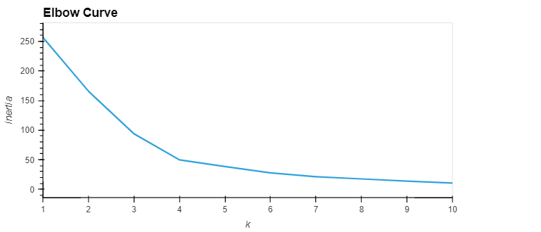
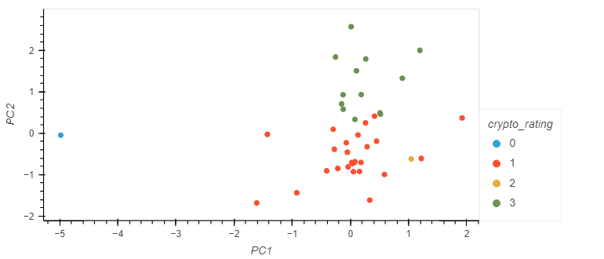
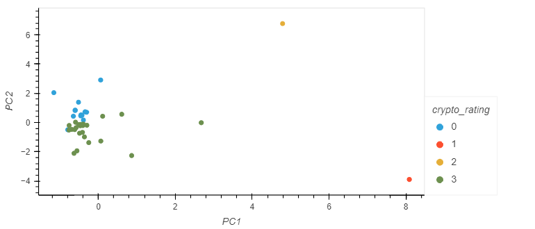

# CryptoClustering

## Using unsupervised learning, this project aims to predict if cryptocurrencies are affected by 24-hour or 7-day price changes. Using the K-means model and PCA method, the cryptocurrency data are fit and trained to identify their clusters and find out which one is the better fit.

## K-means with scaled original data:

## K-means with PCA:

